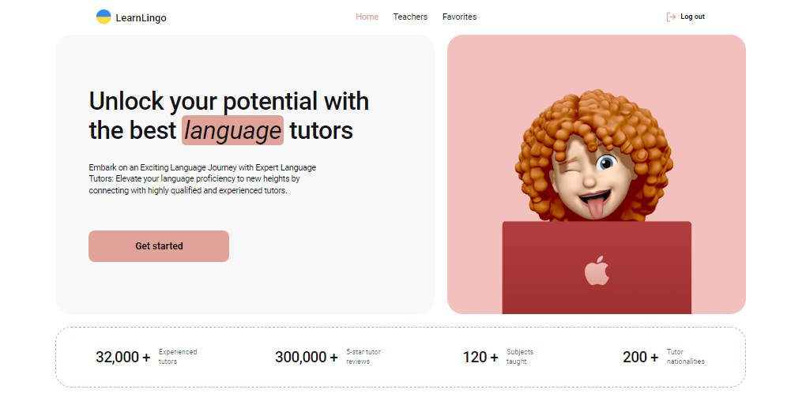

# LearnLingo

This project is an application for a company offering online language tutoring services. The application allows users to quickly find tutors, view their data, and book trial lessons.

## Technologies Used

- **React** to build the user interface and manage components efficiently.
- **Firebase** (Firebase Realtime Database) for storing tutors and user authentication data.
- **React Router** for navigation, enabling users to switch between different views of their tasks seamlessly.
- **React Hook Form and Yup** for form handling and validation.
- **Redux** for state management, providing a centralized store for teachers and facilitating efficient data management.
- **Redux Persist** to persist the Redux store data to the browser's local storage, ensuring data persistence across sessions.
- **Styled components** for styling the application, ensuring a visually appealing design.
- **Responsive design** adapting to different screen sizes.

## Layout

The application layout includes three main pages: "Home", "Teachers", and "Favorites". The app also features modal windows for authentication, viewing additional tutor information, and booking trial lessons.



## Technical Requirements

1. Implemented user authentication using Firebase Authentication (registration, login, fetching current user data, logout).
2. Registration and login forms have minimal validation using React Hook Form and Yup. The modal window with the form closed by clicking the "x" button, clicking on the backdrop, or pressing the Esc key.
3. Tutor data is stored in the Firebase Realtime Database.
4. The "Teachers" page renders four teacher cards with tutor descriptions that can be filtered and loaded more cards upon clicking the "Load more" button.
5. Users can add tutors to favorites and view them on the "Favorites" private page.
6. Users can book trial lessons. The modal window with a form for booking a trial lesson has minimal validation using React Hook Form and Yup.
7. Implemented routing using React Router.
8. Implemented tutor filtering based on different criteria (languages, levels of knowledge, price per hour).
9. Responsive and semantic markup.

## Getting Started

### Installation

1. Clone this repository.

```bash
git clone https://github.com/TaniaUdod/learn-lingo.git
```

2. Install dependencies.

```bash
npm install
```

3. Run the application.

```bash
npm start
```

The application will run on http://localhost:3000/.

### Accessing the Application Online

If you want to access the application online, you can visit
https://taniaudod.github.io/learn-lingo/.
